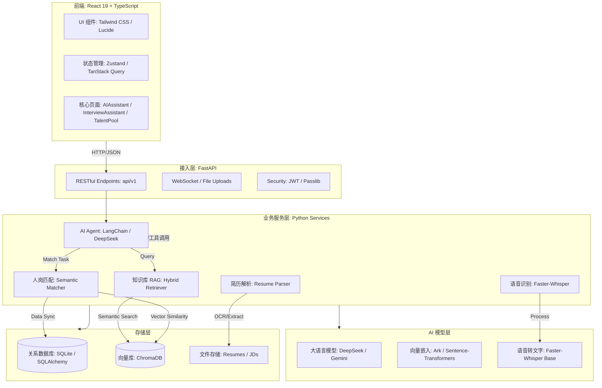
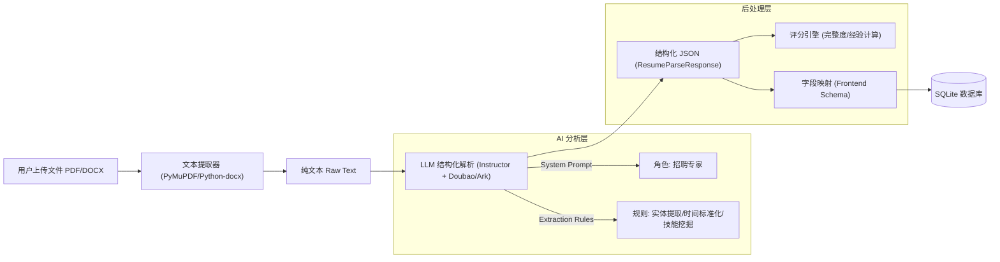
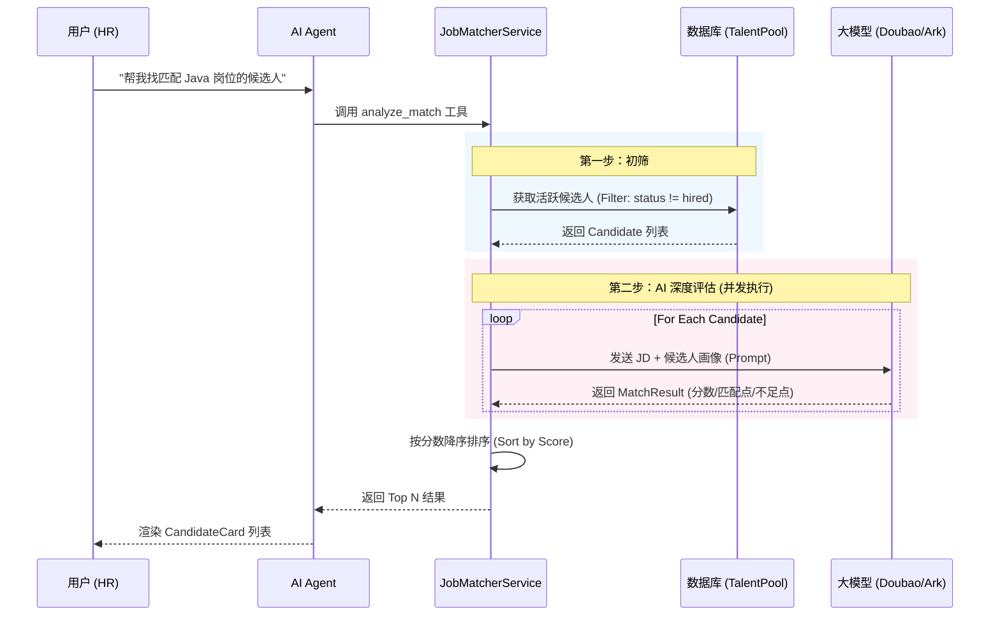

# RecruitAI 智能招聘助手系统 - 技术架构框架

针对 `project` 文件夹中的项目，该系统（RecruitAI）采用了现代化的 **AI-Native 应用架构**。以下是系统的技术选型、模块组成及交互逻辑。

### **1. 系统技术架构图 (Mermaid)**

---

### **2. 核心技术栈说明**

#### **前端 (Web Frontend)**
*   **框架**: [App.tsx](file:///Users/baojuan/Desktop/AIE55%E6%9C%9F%E8%AF%BE%E7%A8%8B%E6%96%87%E4%BB%B6%E5%90%88%E8%AE%A1%EF%BC%88%E6%8C%81%E7%BB%AD%E6%9B%B4%E6%96%B0%EF%BC%89/55%E6%9C%9F%E8%AF%BE%E7%A8%8B%E8%B5%84%E6%96%99/%E5%A4%A7%E6%A8%A1%E5%9E%8B/%E9%A1%B9%E7%9B%AE/%E6%99%BA%E8%83%BD%E6%8B%9B%E8%81%98/project/code/web/fontend/App.tsx) 使用 **React 19** + **TypeScript**。
*   **状态管理**: **Zustand** 管理轻量级全局状态，**TanStack Query** 处理异步请求和数据缓存。
*   **UI/UX**: **Tailwind CSS** 响应式布局，**Recharts** 展示招聘漏斗图表，**Lucide React** 提供图标库。

#### **后端 (Backend)**
*   **核心框架**: **FastAPI**，支持全异步（Asyncio）处理。
*   **AI 智能体**: [AgentService](file:///Users/baojuan/Desktop/AIE55%E6%9C%9F%E8%AF%BE%E7%A8%8B%E6%96%87%E4%BB%B6%E5%90%88%E8%AE%A1%EF%BC%88%E6%8C%81%E7%BB%AD%E6%9B%B4%E6%96%B0%EF%BC%89/55%E6%9C%9F%E8%AF%BE%E7%A8%8B%E8%B5%84%E6%96%99/%E5%A4%A7%E6%A8%A1%E5%9E%8B/%E9%A1%B9%E7%9B%AE/%E6%99%BA%E8%83%BD%E6%8B%9B%E8%81%98/project/code/backend/services/agent/service.py) 基于 **LangChain**，核心模型为 **DeepSeek**。
*   **数据库**: **SQLAlchemy (ORM)** 驱动的 **SQLite**（关系型）和 **ChromaDB**（向量型）。
*   **多模态**: 集成 **Faster-Whisper** 进行面试音频转文字。

---

### **3. 模块间交互逻辑**

1.  **意图驱动**: 
    *   用户在 [AIAssistant](file:///Users/baojuan/Desktop/AIE55%E6%9C%9F%E8%AF%BE%E7%A8%8B%E6%96%87%E4%BB%B6%E5%90%88%E8%AE%A1%EF%BC%88%E6%8C%81%E7%BB%AD%E6%9B%B4%E6%96%B0%EF%BC%89/55%E6%9C%9F%E8%AF%BE%E7%A8%8B%E8%B5%84%E6%96%99/%E5%A4%A7%E6%A8%A1%E5%9E%8B/%E9%A1%B9%E7%9B%AE/%E6%99%BA%E8%83%BD%E6%8B%9B%E8%81%98/project/code/web/fontend/components/AIAssistant.tsx) 提交问题（如：“帮我找下 Java 工程师”）。
    *   后端 Agent 识别意图，调用对应的业务工具（Tools）。
2.  **RAG 检索流程**:
    *   知识库查询请求 -> `KnowledgeService` -> 对问题进行 Embedding -> `ChromaDB` 向量检索 -> 检索结果 + 提示词 -> LLM 总结 -> 返回前端。
3.  **人岗匹配流程**:
    *   匹配指令 -> `JobMatcherService` -> 提取 JD 向量 -> 在 `ChromaDB` 中查找相似简历 -> 结合 SQLite 中的基础信息 -> 生成 `CandidateCard` 结构化 JSON -> 前端渲染卡片。
4.  **面试辅助流程**:
    *   面试官开启录音 -> [stt.py](file:///Users/baojuan/Desktop/AIE55%E6%9C%9F%E8%AF%BE%E7%A8%8B%E6%96%87%E4%BB%B6%E5%90%88%E8%AE%A1%EF%BC%88%E6%8C%81%E7%BB%AD%E6%9B%B4%E6%96%B0%EF%BC%89/55%E6%9C%9F%E8%AF%BE%E7%A8%8B%E8%B5%84%E6%96%99/%E5%A4%A7%E6%A8%A1%E5%9E%8B/%E9%A1%B9%E7%9B%AE/%E6%99%BA%E8%83%BD%E6%8B%9B%E8%81%98/project/code/backend/api/v1/endpoints/stt.py) 实时转义 -> [InterviewAssistant](file:///Users/baojuan/Desktop/AIE55%E6%9C%9F%E8%AF%BE%E7%A8%8B%E6%96%87%E4%BB%B6%E5%90%88%E8%AE%A1%EF%BC%88%E6%8C%81%E7%BB%AD%E6%9B%B4%E6%96%B0%EF%BC%89/55%E6%9C%9F%E8%AF%BE%E7%A8%8B%E8%B5%84%E6%96%99/%E5%A4%A7%E6%A8%A1%E5%9E%8B/%E9%A1%B9%E7%9B%AE/%E6%99%BA%E8%83%BD%E6%8B%9B%E8%81%98/project/code/web/fontend/components/InterviewAssistant.tsx) 渲染对话实时流 -> AI 生成追问建议。

---

### **4. 核心模块详解**

#### **4.1 智能简历解析 (Resume Parser)**

该模块负责将非结构化的文件（PDF/Word/图片）转化为标准化的候选人数据。

**核心流程图：**

**关键技术点：**
*   **Instructor**: 使用 `instructor` 库强制 LLM 输出符合 Pydantic Model (`ResumeParseResponse`) 的严格 JSON 格式，解决了传统 LLM 输出格式不稳定的问题。
*   **智能评分**: 除了基础信息提取，系统还会根据简历的完整度（是否有联系方式、教育背景、工作经历详细程度）自动计算 `parsing_score`，辅助 HR 快速筛选。
*   **技能挖掘**: Prompt 中包含指令，要求 AI 不仅提取显性技能，还要从项目描述中推断隐性技术栈。

#### **4.2 人岗匹配引擎 (Job Matcher)**

该模块实现了基于多维度的候选人与职位描述 (JD) 的深度匹配。

**核心流程图：**

**关键技术点：**
*   **并发评估**: 使用 `asyncio.gather` 并发调用 LLM 对多位候选人进行评估，大幅缩短等待时间。
*   **多维评估模型**: Prompt 设计了三个核心维度：
    1.  **技能匹配**: 硬性技术栈是否对齐。
    2.  **经验匹配**: 年限、行业背景是否符合。
    3.  **教育匹配**: 学历要求是否达标。
*   **结构化输出**: 匹配结果包含 `score` (0-100分)、`matching_points` (亮点) 和 `mismatched_points` (不足)，直接用于前端展示，无需二次解析。
