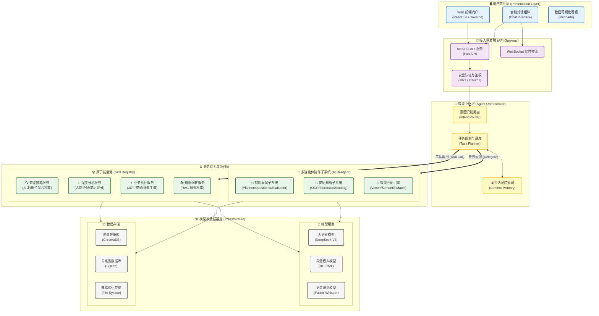
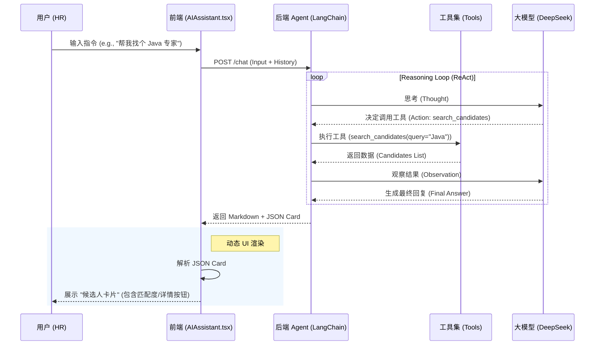
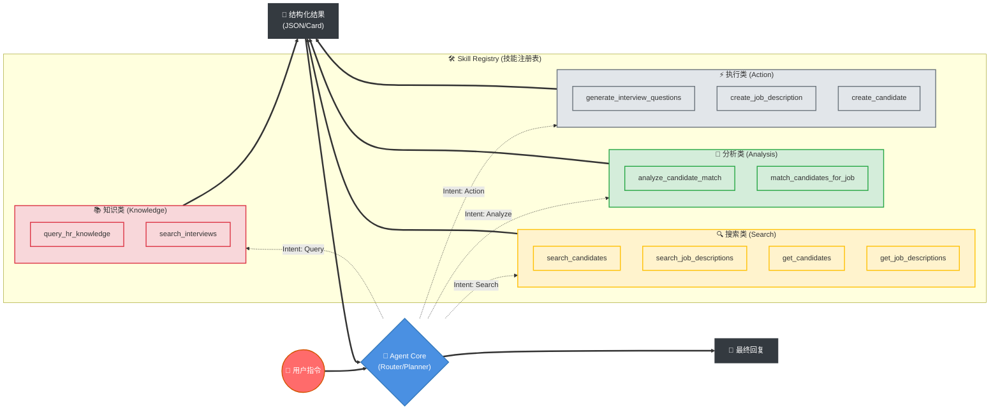
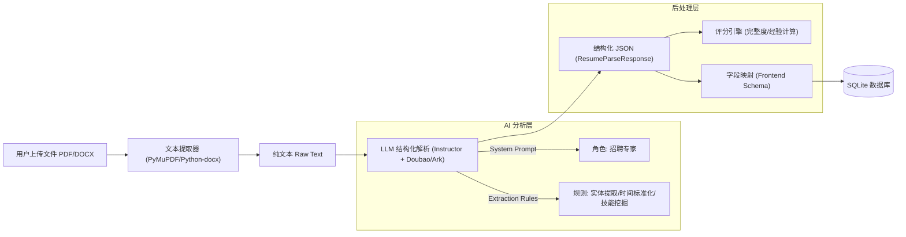
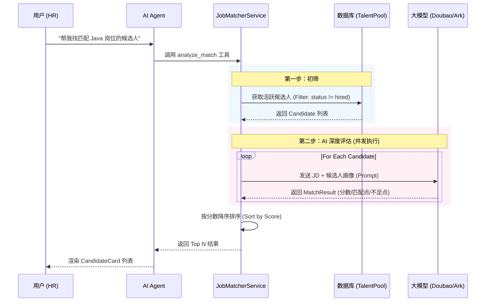
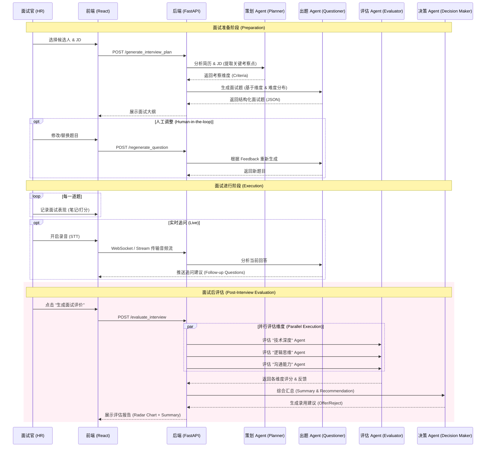
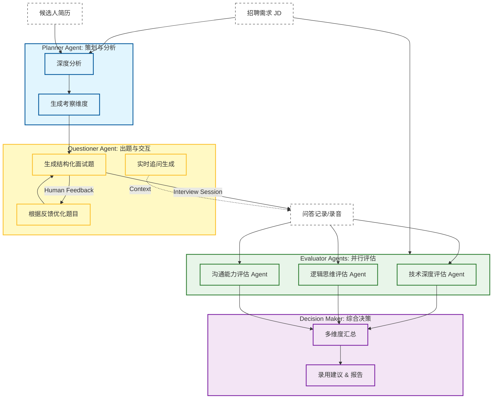
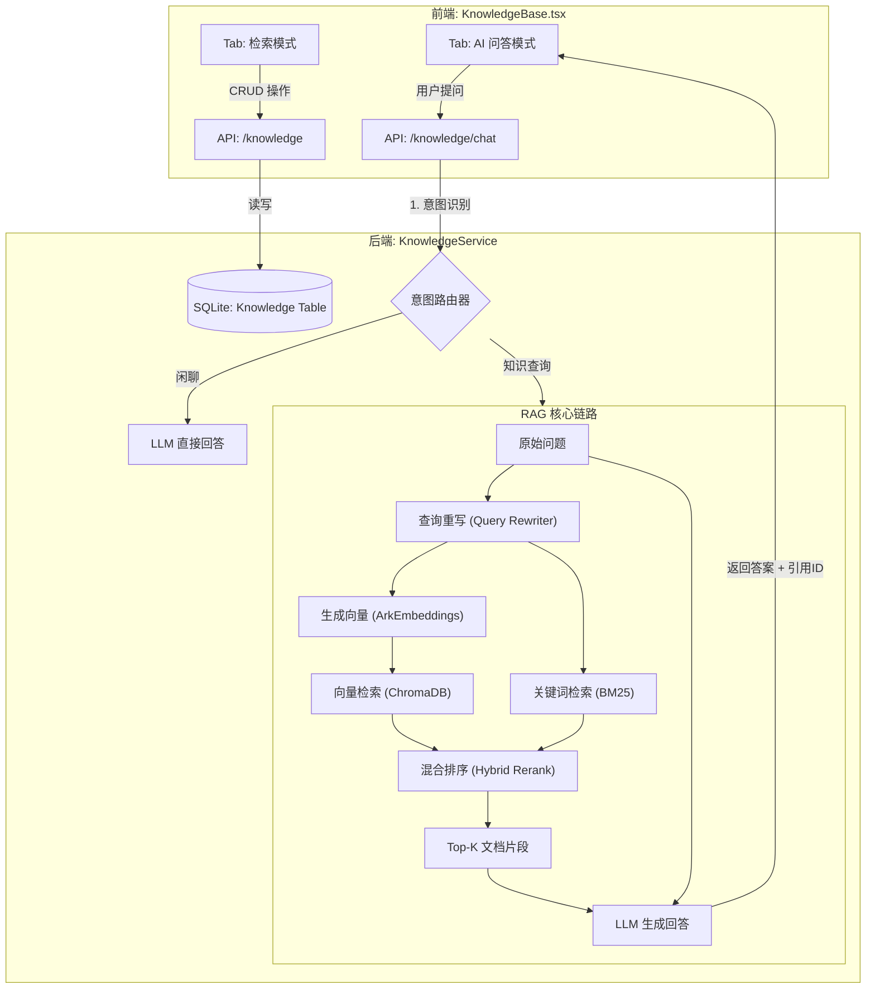
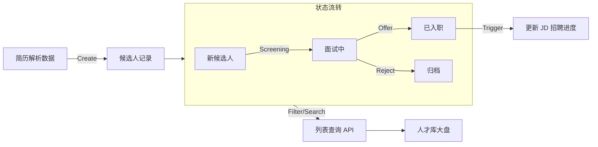

# RecruitAI 智能招聘助手系统 - 技术架构框架

针对 `project` 文件夹中的项目，该系统（RecruitAI）采用了现代化的 **AI-Native 应用架构**。以下是系统的技术选型、模块组成及交互逻辑。

### **1. 系统技术架构图 (Mermaid)**



---

```mermaid
%%{init: {
  'theme': 'base',
  'themeVariables': {
    'primaryColor': '#EEF2FF',
    'primaryTextColor': '#1E293B',
    'primaryBorderColor': '#6366F1',
    'lineColor': '#94A3B8',
    'secondaryColor': '#F0FDFA',
    'tertiaryColor': '#FFF7ED',
    'fontFamily': 'Inter, system-ui, sans-serif',
    'fontSize': '14px'
  },
  'flowchart': {
    'htmlLabels': true,
    'curve': 'basis',
    'padding': 20,
    'nodeSpacing': 50,
    'rankSpacing': 80
  }
}%%

graph TB
    %% 定义现代玻璃拟态风格
    classDef uiLayer fill:linear-gradient(135deg,#667eea 0%,#764ba2 100%),stroke:#4F46E5,stroke-width:3px,color:#fff,rx:12,ry:12,box-shadow:0 8px 32px rgba(102,126,234,0.3);
    classDef gatewayLayer fill:linear-gradient(135deg,#f093fb 0%,#f5576c 100%),stroke:#DB2777,stroke-width:3px,color:#fff,rx:12,ry:12,box-shadow:0 8px 32px rgba(245,87,108,0.3);
    classDef brainLayer fill:linear-gradient(135deg,#4facfe 0%,#00f2fe 100%),stroke:#0891B2,stroke-width:3px,color:#fff,rx:12,ry:12,box-shadow:0 8px 32px rgba(79,172,254,0.3);
    classDef bizLayer fill:linear-gradient(135deg,#43e97b 0%,#38f9d7 100%),stroke:#059669,stroke-width:3px,color:#fff,rx:12,ry:12,box-shadow:0 8px 32px rgba(67,233,123,0.3);
    classDef infraLayer fill:linear-gradient(135deg,#fa709a 0%,#fee140 100%),stroke:#DC2626,stroke-width:3px,color:#fff,rx:12,ry:12,box-shadow:0 8px 32px rgba(250,112,154,0.3);
    
    classDef subGroup fill:rgba(255,255,255,0.9),stroke:#CBD5E1,stroke-width:2px,stroke-dasharray: 5 5,rx:8,ry:8;
    classDef connector fill:none,stroke:#64748B,stroke-width:2px,stroke-dasharray: 3 3;

    %% 1. 用户交互层 - 紫罗兰渐变
    subgraph Layer_UI ["🎨 用户交互层 | Presentation Layer"]
        direction LR
        UI_Portal["🌐 Web 门户<br/><span style='font-size:12px;opacity:0.9'>React 19 + Tailwind</span>"]
        UI_Chat["💬 智能对话<br/><span style='font-size:12px;opacity:0.9'>实时交互界面</span>"]
        UI_Visual["📊 数据可视化<br/><span style='font-size:12px;opacity:0.9'>Recharts 图表</span>"]
    end

    %% 2. 接入网关层 - 玫瑰渐变
    subgraph Layer_Gateway ["🛡️ 接入网关层 | API Gateway"]
        direction LR
        API_Rest["⚡ RESTful API<br/><span style='font-size:12px;opacity:0.9'>FastAPI 高性能</span>"]
        API_Socket["🔄 WebSocket<br/><span style='font-size:12px;opacity:0.9'>实时推流</span>"]
        API_Auth["🔐 安全认证<br/><span style='font-size:12px;opacity:0.9'>JWT / OAuth2</span>"]
    end

    %% 3. 智能中枢层 - 青色渐变
    subgraph Layer_Brain ["🧠 智能中枢层 | Agent Orchestrator"]
        direction LR
        Brain_Router["🎯 意图识别路由<br/><span style='font-size:12px;opacity:0.9'>Intent Router</span>"]
        Brain_Planner["📋 任务规划调度<br/><span style='font-size:12px;opacity:0.9'>Task Planner</span>"]
        Brain_Memory["💾 会话记忆管理<br/><span style='font-size:12px;opacity:0.9'>Context Memory</span>"]
    end

    %% 4. 业务能力层 - 翡翠渐变
    subgraph Layer_Biz ["⚙️ 业务能力层 | Business Capabilities"]
        direction TB
        
        subgraph Module_Skills ["🔧 原子技能池 | Skill Registry"]
            direction LR
            Skill_Search["🔍 智能搜索<br/>混合检索"]
            Skill_Analysis["🧠 深度分析<br/>人岗匹配"]
            Skill_Action["⚡ 业务执行<br/>内容生成"]
            Skill_KB["📚 知识问答<br/>RAG 检索"]
        end

        subgraph Module_Agents ["👥 多智能体协作 | Multi-Agent"]
            direction LR
            Agent_Interview["🎤 面试系统<br/>Planner/Evaluator"]
            Agent_Resume["📄 简历解析<br/>OCR/Extraction"]
            Agent_Match["🧩 匹配引擎<br/>向量语义匹配"]
        end
    end

    %% 5. 基础设施层 - 暖阳渐变
    subgraph Layer_Infra ["🏗️ 模型与数据基座 | Infrastructure"]
        direction TB
        
        subgraph Models ["🤖 模型服务 | Model Services"]
            direction LR
            Model_LLM["🧠 DeepSeek-V3<br/>大语言模型"]
            Model_Embed["🔢 BGE/Ark<br/>向量嵌入"]
            Model_ASR["🎙️ Faster-Whisper<br/>语音识别"]
        end

        subgraph Data ["💾 数据存储 | Data Storage"]
            direction LR
            DB_Vector["🗂️ ChromaDB<br/>向量数据库"]
            DB_SQL["🗄️ SQLite<br/>关系型数据库"]
            DB_File["📁 File System<br/>非结构化存储"]
        end
    end

    %% 连接关系 - 使用动态虚线和箭头
    UI_Portal -.->|HTTP/HTTPS| API_Rest
    UI_Chat -.->|REST| API_Rest
    UI_Chat -.->|WebSocket| API_Socket
    UI_Visual -.->|API| API_Rest

    API_Rest --> API_Auth
    API_Socket --> API_Auth
    API_Auth --> Brain_Router

    Brain_Router --> Brain_Planner
    Brain_Planner <--> Brain_Memory
    
    %% 粗实线表示核心调度
    Brain_Planner ==>|🛠️ 工具调用| Module_Skills
    Brain_Planner ==>|👥 任务委派| Module_Agents

    %% 业务层到基础设施
    Module_Skills -.-> Models
    Module_Skills -.-> Data
    Module_Agents -.-> Models
    Module_Agents -.-> Data

    %% 样式应用
    class UI_Portal,UI_Chat,UI_Visual uiLayer;
    class API_Rest,API_Socket,API_Auth gatewayLayer;
    class Brain_Router,Brain_Planner,Brain_Memory brainLayer;
    class Skill_Search,Skill_Analysis,Skill_Action,Skill_KB,Agent_Interview,Agent_Resume,Agent_Match bizLayer;
    class Model_LLM,Model_Embed,Model_ASR,DB_Vector,DB_SQL,DB_File infraLayer;
    
    class Layer_UI,Layer_Gateway,Layer_Brain,Layer_Biz,Layer_Infra subGroup;
```

---

### **2. 核心技术栈说明**

#### **前端 (Web Frontend)**
*   **框架**: [App.tsx](file:///Users/baojuan/Desktop/AIE55%E6%9C%9F%E8%AF%BE%E7%A8%8B%E6%96%87%E4%BB%B6%E5%90%88%E8%AE%A1%EF%BC%88%E6%8C%81%E7%BB%AD%E6%9B%B4%E6%96%B0%EF%BC%89/55%E6%9C%9F%E8%AF%BE%E7%A8%8B%E8%B5%84%E6%96%99/%E5%A4%A7%E6%A8%A1%E5%9E%8B/%E9%A1%B9%E7%9B%AE/%E6%99%BA%E8%83%BD%E6%8B%9B%E8%81%98/project/code/web/fontend/App.tsx) 使用 **React 19** + **TypeScript**。
*   **状态管理**: **Zustand** 管理轻量级全局状态，**TanStack Query** 处理异步请求和数据缓存。
*   **UI/UX**: **Tailwind CSS** 响应式布局，**Recharts** 展示招聘漏斗图表，**Lucide React** 提供图标库。

#### **后端 (Backend)**
*   **核心框架**: **FastAPI**，支持全异步（Asyncio）处理。
*   **AI 智能体**: [AgentService](file:///Users/baojuan/Desktop/AIE55%E6%9C%9F%E8%AF%BE%E7%A8%8B%E6%96%87%E4%BB%B6%E5%90%88%E8%AE%A1%EF%BC%88%E6%8C%81%E7%BB%AD%E6%9B%B4%E6%96%B0%EF%BC%89/55%E6%9C%9F%E8%AF%BE%E7%A8%8B%E8%B5%84%E6%96%99/%E5%A4%A7%E6%A8%A1%E5%9E%8B/%E9%A1%B9%E7%9B%AE/%E6%99%BA%E8%83%BD%E6%8B%9B%E8%81%98/project/code/backend/services/agent/service.py) 基于 **LangChain**，核心模型为 **DeepSeek**。
*   **数据库**: **SQLAlchemy (ORM)** 驱动的 **SQLite**（关系型）和 **ChromaDB**（向量型）。
*   **多模态**: 集成 **Faster-Whisper** 进行面试音频转文字。

---

### **3. 模块间交互逻辑**

1.  **意图驱动**: 
    *   用户在 [AIAssistant](file:///Users/baojuan/Desktop/AIE55%E6%9C%9F%E8%AF%BE%E7%A8%8B%E6%96%87%E4%BB%B6%E5%90%88%E8%AE%A1%EF%BC%88%E6%8C%81%E7%BB%AD%E6%9B%B4%E6%96%B0%EF%BC%89/55%E6%9C%9F%E8%AF%BE%E7%A8%8B%E8%B5%84%E6%96%99/%E5%A4%A7%E6%A8%A1%E5%9E%8B/%E9%A1%B9%E7%9B%AE/%E6%99%BA%E8%83%BD%E6%8B%9B%E8%81%98/project/code/web/fontend/components/AIAssistant.tsx) 提交问题（如：“帮我找下 Java 工程师”）。
    *   后端 Agent 识别意图，调用对应的业务工具（Tools）。
2.  **RAG 检索流程**:
    *   知识库查询请求 -> `KnowledgeService` -> 对问题进行 Embedding -> `ChromaDB` 向量检索 -> 检索结果 + 提示词 -> LLM 总结 -> 返回前端。
3.  **人岗匹配流程**:
    *   匹配指令 -> `JobMatcherService` -> 提取 JD 向量 -> 在 `ChromaDB` 中查找相似简历 -> 结合 SQLite 中的基础信息 -> 生成 `CandidateCard` 结构化 JSON -> 前端渲染卡片。
4.  **面试辅助流程**:
    *   面试官开启录音 -> [stt.py](file:///Users/baojuan/Desktop/AIE55%E6%9C%9F%E8%AF%BE%E7%A8%8B%E6%96%87%E4%BB%B6%E5%90%88%E8%AE%A1%EF%BC%88%E6%8C%81%E7%BB%AD%E6%9B%B4%E6%96%B0%EF%BC%89/55%E6%9C%9F%E8%AF%BE%E7%A8%8B%E8%B5%84%E6%96%99/%E5%A4%A7%E6%A8%A1%E5%9E%8B/%E9%A1%B9%E7%9B%AE/%E6%99%BA%E8%83%BD%E6%8B%9B%E8%81%98/project/code/backend/api/v1/endpoints/stt.py) 实时转义 -> [InterviewAssistant](file:///Users/baojuan/Desktop/AIE55%E6%9C%9F%E8%AF%BE%E7%A8%8B%E6%96%87%E4%BB%B6%E5%90%88%E8%AE%A1%EF%BC%88%E6%8C%81%E7%BB%AD%E6%9B%B4%E6%96%B0%EF%BC%89/55%E6%9C%9F%E8%AF%BE%E7%A8%8B%E8%B5%84%E6%96%99/%E5%A4%A7%E6%A8%A1%E5%9E%8B/%E9%A1%B9%E7%9B%AE/%E6%99%BA%E8%83%BD%E6%8B%9B%E8%81%98/project/code/web/fontend/components/InterviewAssistant.tsx) 渲染对话实时流 -> AI 生成追问建议。

---

### **4. 核心模块详解**

#### **4.0 全局智能助手 (Global AI Assistant)**

该模块是用户与系统交互的统一入口（Chat Interface），位于首页 Tab。它充当 **中央调度器 (Central Dispatcher)** 的角色，理解用户自然语言指令，动态调用后台各业务工具，并以结构化卡片（Card UI）的形式返回结果。

**核心流程图：**



**关键技术点：**

*   **ReAct 范式**: 采用 `Reasoning + Acting` 模式，Agent 在回答前会先思考是否需要调用工具（如搜索数据库、查询面试记录），确保回复基于实时数据而非模型幻觉。
*   **结构化协议 (Card Protocol)**: 后端 Agent 不仅输出文本，还会输出特定格式的 JSON（如 `CandidateCard`, `JobCard`）。前端通过 `cleanJsonContent` 解析器提取这些 JSON，渲染为可交互的 React 组件（如点击“安排面试”按钮）。
*   **强制工作流 (Enforced Workflow)**: System Prompt 中植入了严格的业务规则（如“先搜索再结论”、“严禁直接入库无意义文本”），保障了 Agent 行为的可控性和安全性。

#### **4.0.1 Skill 技能调度架构 (Skill Dispatch)**

为了体现系统对“技能 (Skill)”技术的应用，即 Agent 如何通过工具调用（Tool Calling）扩展能力边界，特补充以下视图：



**Skill 技术实现机制：**
1.  **注册机制**: 所有 Skill (继承自 `BaseTool`) 在系统启动时注册到 `Skill Registry`，每个 Skill 包含 `name`, `description` 和 `args_schema` (Pydantic 模型)。
2.  **意图识别**: Agent 根据用户输入的语义，利用 LLM 的 Function Calling 能力，自动匹配最合适的 Skill。
3.  **参数提取**: Agent 自动从上下文中提取 Skill 所需的结构化参数（如：从 "帮我找 Java" 中提取 `query="Java"`）。
4.  **执行与反馈**: Skill 执行具体的业务逻辑（数据库查询/算法调用），并将结果以 JSON 格式返回给 Agent 进行二次处理。

#### **4.1 智能简历解析 (Resume Parser)**

该模块负责将非结构化的文件（PDF/Word/图片）转化为标准化的候选人数据。

**核心流程图：**



**关键技术点：**
*   **Instructor**: 使用 `instructor` 库强制 LLM 输出符合 Pydantic Model (`ResumeParseResponse`) 的严格 JSON 格式，解决了传统 LLM 输出格式不稳定的问题。
*   **智能评分**: 除了基础信息提取，系统还会根据简历的完整度（是否有联系方式、教育背景、工作经历详细程度）自动计算 `parsing_score`，辅助 HR 快速筛选。
*   **技能挖掘**: Prompt 中包含指令，要求 AI 不仅提取显性技能，还要从项目描述中推断隐性技术栈。

#### **4.2 人岗匹配引擎 (Job Matcher)**

该模块实现了基于多维度的候选人与职位描述 (JD) 的深度匹配。

**核心流程图：**



**关键技术点：**
*   **并发评估**: 使用 `asyncio.gather` 并发调用 LLM 对多位候选人进行评估，大幅缩短等待时间。
*   **多维评估模型**: Prompt 设计了三个核心维度：
    1.  **技能匹配**: 硬性技术栈是否对齐。
    2.  **经验匹配**: 年限、行业背景是否符合。
    3.  **教育匹配**: 学历要求是否达标。
*   **结构化输出**: 匹配结果包含 `score` (0-100分)、`matching_points` (亮点) 和 `mismatched_points` (不足)，直接用于前端展示，无需二次解析。

#### **4.3 智能面试助手 (AI Interview Assistant) - Multi-Agent 架构**



**关键技术点 (Multi-Agent Collaboration)：**

*   **分工明确 (Role Specialization)**: 系统被拆分为多个专职 Agent，各司其职：
    *   **Planner Agent**: 负责顶层规划，分析 JD 和简历，确定考察维度。
    *   **Questioner Agent**: 负责具体执行，生成结构化面试题，并支持实时追问。
    *   **Evaluator Agent**: 负责垂直领域的深度评估，并行工作以提高效率。
    *   **Decision Maker Agent**: 负责全局汇总，综合各方意见给出最终决策。
*   **并行计算 (Parallel Execution)**: 在评估阶段，利用 `asyncio.gather` 同时调用多个 Evaluator Agent，显著降低了长文本分析的等待时间（Latency）。
*   **人机协同 (Human-in-the-loop)**: 在生成面试题阶段，Agent 并非“一言堂”，而是允许 HR 介入修改（Feedback），Agent 会根据反馈动态调整后续输出。
*   **结构化输出 (Structured Output)**: 所有 Agent 均通过 `instructor` 库强制输出 JSON 格式，确保了系统间数据流转的稳定性。

#### **4.3.1 Agent 协同视图 (Collaboration Graph)**

为了更直观地展示各 Agent 之间的协作关系与数据流转，特补充以下协同视图：



#### **4.4 HR 知识库 (Knowledge Base)**

该模块在前端（`KnowledgeBase.tsx`）分为 **“检索模式”** 和 **“AI 问答模式”** 两个核心 Tab，分别对应 **知识管理 (CRUD)** 和 **智能问答 (RAG)** 两大业务流。

**1. 检索模式 (Search Mode)**
提供对内部知识（面试标准、考察重点、公司制度）的增删改查及标签筛选。

**2. AI 问答模式 (Chat Mode / RAG)**
基于 RAG 技术，允许 HR 用自然语言提问，系统通过混合检索生成带引用的回答。

**核心流程图：**



**关键技术点：**
*   **双模式设计**: 前端通过 `activeTab` 状态切换视图，满足“查阅文档”和“解决问题”两种不同场景。
*   **混合检索 (Hybrid Search)**: 结合向量检索 (ChromaDB) 和 关键词检索 (BM25)，有效解决专业术语匹配不准的问题。
*   **冷启动策略**: `seed_data_if_empty` 方法保证了系统初始化时会自动写入默认的 HR 知识条目，开箱即用。

#### **4.5 人才库管理 (Talent Pool)**

该模块负责候选人全生命周期的状态管理和数据持久化。

**核心流程图：**



**关键技术点：**
*   **状态联动**: 当候选人状态变更为 `hired` 时，系统会自动触发关联 JD 的 `current_hired_count` +1，保证了招聘进度的实时一致性。
*   **多维筛选**: `CRUD` 层实现了基于 `position`、`status`、`search` (模糊匹配姓名/邮箱) 的动态 SQL 组合查询。
*   **去重机制**: 在创建候选人时，自动检查 `name` + `contact` 是否已存在，防止重复录入。

#### **4.6 招聘培训 (Recruit Training) - (规划中)**

目前处于 `TODO` 状态，规划利用 AI 分析候选人技能缺口，自动推荐入职培训课程（如：技术栈入门、企业文化等）。
