# RecruitAI 智能招聘助手系统 - 技术架构框架

针对 `project` 文件夹中的项目，该系统（RecruitAI）采用了现代化的 **AI-Native 应用架构**。以下是系统的技术选型、模块组成及交互逻辑。

### **1. 系统技术架构图 (Mermaid)**

```mermaid
graph TD
    %% 前端层
    subgraph Frontend [前端: React 19 + TypeScript]
        UI[UI 组件: Tailwind CSS / Lucide]
        State[状态管理: Zustand / TanStack Query]
        Comps[核心页面: AIAssistant / InterviewAssistant / TalentPool]
    end

    %% API 接入层
    subgraph API_Layer [接入层: FastAPI]
        RestAPI[RESTful Endpoints: api/v1]
        WS[WebSocket / File Uploads]
        Auth[Security: JWT / Passlib]
    end

    %% 业务逻辑层
    subgraph Service_Layer [业务服务层: Python Services]
        Agent[AI Agent: LangChain / DeepSeek]
        RAG[知识库 RAG: Hybrid Retriever]
        Matcher[人岗匹配: Semantic Matcher]
        Parser[简历解析: Resume Parser]
        STT[语音识别: Faster-Whisper]
    end

    %% AI 模型层
    subgraph AI_Models [AI 模型层]
        LLM[大语言模型: DeepSeek / Gemini]
        Embedding[向量嵌入: Ark / Sentence-Transformers]
        Whisper[语音转文字: Faster-Whisper Base]
    end

    %% 数据存储层
    subgraph Data_Storage [存储层]
        SQLite[(关系数据库: SQLite / SQLAlchemy)]
        ChromaDB[(向量库: ChromaDB)]
        Files[文件存储: Resumes / JDs]
    end

    %% 核心交互流向
    Frontend -- "HTTP/JSON" --> RestAPI
    RestAPI --> Agent
    Agent -- "意图路由/工具调用" --> Service_Layer
    
    Service_Layer --> AI_Models
    Service_Layer --> Data_Storage
    
    %% 详细工具链交互
    Agent -- "Query" --> RAG
    RAG -- "Semantic Search" --> ChromaDB
    Agent -- "Match Task" --> Matcher
    Matcher -- "Vector Similarity" --> ChromaDB
    Matcher -- "Data Sync" --> SQLite
    Parser -- "OCR/Extract" --> Files
    STT -- "Process" --> Whisper
```

---

### **2. 核心技术栈说明**

#### **前端 (Web Frontend)**
*   **框架**: [App.tsx] 使用 **React 19** + **TypeScript**。
*   **状态管理**: **Zustand** 管理轻量级全局状态，**TanStack Query** 处理异步请求和数据缓存。
*   **UI/UX**: **Tailwind CSS** 响应式布局，**Recharts** 展示招聘漏斗图表，**Lucide React** 提供图标库。

#### **后端 (Backend)**
*   **核心框架**: **FastAPI**，支持全异步（Asyncio）处理。
*   **AI 智能体**: [AgentService] 基于 **LangChain**，核心模型为 **DeepSeek**。
*   **数据库**: **SQLAlchemy (ORM)** 驱动的 **SQLite**（关系型）和 **ChromaDB**（向量型）。
*   **多模态**: 集成 **Faster-Whisper** 进行面试音频转文字。

---

### **3. 模块间交互逻辑**

1.  **意图驱动**: 
    *   用户在 [AIAssistant] 提交问题（如：“帮我找下 Java 工程师”）。
    *   后端 Agent 识别意图，调用对应的业务工具（Tools）。
2.  **RAG 检索流程**:
    *   知识库查询请求 -> `KnowledgeService` -> 对问题进行 Embedding -> `ChromaDB` 向量检索 -> 检索结果 + 提示词 -> LLM 总结 -> 返回前端。
3.  **人岗匹配流程**:
    *   匹配指令 -> `JobMatcherService` -> 提取 JD 向量 -> 在 `ChromaDB` 中查找相似简历 -> 结合 SQLite 中的基础信息 -> 生成 `CandidateCard` 结构化 JSON -> 前端渲染卡片。
4.  **面试辅助流程**:
    *   面试官开启录音 -> [stt.py] 实时转义 -> [InterviewAssistant] 渲染对话实时流 -> AI 生成追问建议。
