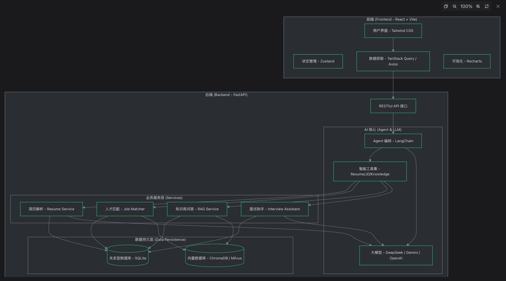

          
针对您提供的项目文件夹，我为您梳理了一份技术架构框架。该系统（智能招聘助手 RecruitAI）采用了现代化的前后端分离架构，并深度集成了大语言模型（LLM）与向量数据库（RAG）。

### **技术架构图**

### 模块技术细节
1. 前端模块 (Frontend)

- 核心框架 : App.tsx 采用 React 19 和 TypeScript 构建。
- 状态管理 : 使用 Zustand 进行轻量级状态管理，相比 Redux 更简洁。
- 数据流 : TanStack Query 负责管理服务器状态、缓存和异步请求。
- UI 组件 : 基于 Tailwind CSS，结合 Lucide React 图标库和 Recharts 报表。
2. 后端模块 (Backend)

- Web 框架 : main.py 使用 FastAPI 提供高性能的异步 API 支持。
- AI Agent : service.py 基于 LangChain 构建，集成了 DeepSeek 智能体，能够根据用户意图调用不同的业务工具。
- RAG 系统 : 结合 ChromaDB 向量数据库和 Sentence-Transformers，实现招聘知识库的精准检索。
- ORM 映射 : 通过 SQLAlchemy 管理 models 目录下的关系型数据（如候选人、面试计划等）。
3. 模块交互流程

- 用户请求 : 前端通过 API 路由 api.py 向后端发送指令。
- 任务分发 : 后端 Agent 接收到请求后，利用 LLM 进行意图识别。
- 协同执行 :
  - 如果是简历解析，调用 ResumeParserService 。
  - 如果是职位匹配，调用 JobMatcherService 并从 VectorDB 检索语义相似度。
  - 如果是知识查询，通过 KnowledgeService 进行 RAG 检索并总结。
- 数据反馈 : 处理结果存入 SQLite 并实时返回给前端，前端通过状态管理更新 UI 展示界面。
这份架构充分利用了 FastAPI 的异步特性 和 LangChain 的智能编排能力 ，是一个典型的 AI 原生应用（AI-Native Application）。